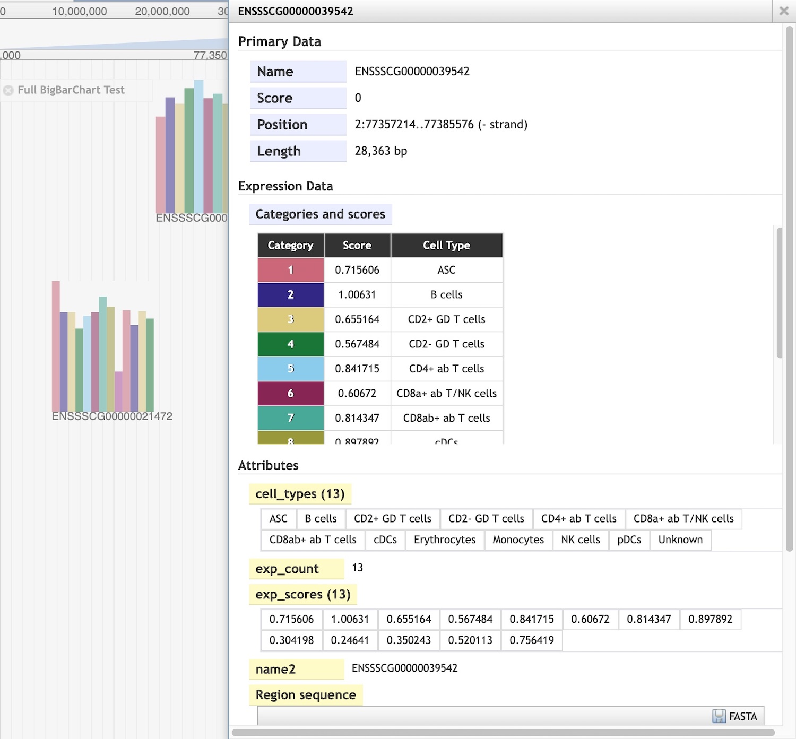

# BarChartViewer

JBrowse 1 plugin for displaying data in [barChart](https://genome.ucsc.edu/goldenPath/help/barChart.html) format.


## Screenshots


Feature details showing categories and scores:




## Details

This plugin supports BED or BigBED files in [barChart](https://genome.ucsc.edu/goldenPath/help/barChart.html) format.

Each BarChart is rendered using the start and end coordinates specified for each feature.

The overall width of each BarChart corresponds to the width of the feature itself. The individual bars have equal width 
(overall width divided by the number of bars/categories). 

The bar heights are equal to the category scores multiplied by a factor and scaled according to their log base 10. The 
log scale is optional and can be toggled in the track options menu. The log scale, log base, and scale factor may be 
set in the track configuration. The scaling options apply to all BarChart features in the same track to allow for 
visual comparisons of bar heights across all features.

At a sufficient zoomed-in level, category number labels appear below each bar. Their display may be toggled in the 
track options menu.


## Example configurations

### BED files

```
  {
      "glyph": "BarChartViewer/View/FeatureGlyph/BarChart",
      "label": "barchart_bed_example",
      "storeClass": "BarChartViewer/Store/SeqFeature/BarChart",
      "style": {
        "className": "feature",
        "color": "blue",
        "palette": "muted",
        "minHeight": 10,
        "textHeight": 10.
        "scaleFactor": 500,
        "useLogScale": true,
        "logBase": 10
      },
      "type": "BarChartViewer/View/Track/BarChart",
      "urlTemplate": "barchart_example.bed"
  }
```

### BigBED files

```
  {
      "glyph": "BarChartViewer/View/FeatureGlyph/BarChart",
      "label": "barchart_bigbed_example",
      "storeClass": "JBrowse/Store/SeqFeature/BigBed",
      "type": "BarChartViewer/View/Track/BarChart",
      "urlTemplate": "barchart_example.bb"
  }
```

### Optional configuration settings

* style.color - background color for summary bars
* style.palette - color palette for bar charts (see details below)
* style.minHeight - minimum feature height (default 10)
* style.textHeight - height of category labels below each feature (default 10)
* style.scaleFactor - multiplier used in setting bar heights from scores (default 500)
* style.useLogScale - whether to apply log function to scores before scaling (default true)
* style.logBase - base for log scaling (default 10)

### Color palettes

Choose from predefined palettes or define a custom color palette.

Colorblind-safe palettes taken from 
[https://personal.sron.nl/~pault/#sec:qualitative](https://personal.sron.nl/~pault/#sec:qualitative):

* bright: seven colors (blue, red, green, yellow, cyan, purple, grey)
* vibrant: seven colors (orange, blue, cyan, magenta, red, teal, grey)
* high-contrast: three colors (blue, yellow, red)
* light: nine colors (light blue, orange, light yellow, pink, light cyan, mint, pear, olive, pale grey)
* muted (default palette): nine colors (rose, indigo, sand, green, cyan, wine, teal, olive, purple)

Example ```trackList.json``` custom palette definition:

```
  "style": {
    "palette": "custom",
    "paletteColors": ["#ff0000", "#00ff00", "#0000ff"]
  }
```

The palette may also be selected from the track options menu (predefined palettes only; custom palettes 
must be entered into the config JSON).


## Support

This work was supported by Agriculture and Food Research Initiative Competitive grant no. 2021-70412-35233 from the 
USDA National Institute of Food and Agriculture.

